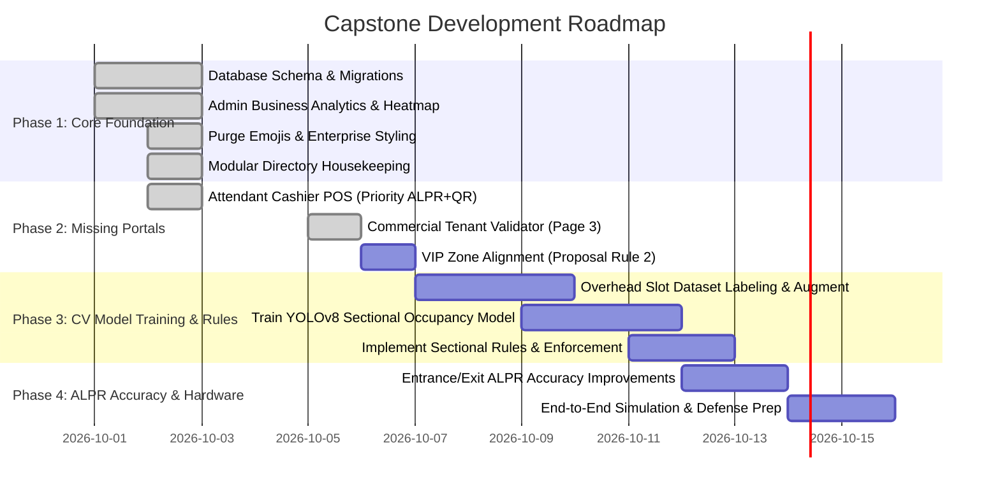

# Project Implementation & Architecture Tracker
**Automated Parking Management System (Parking Ltd.)**  
*Capstone Reference: CAP-2520-IT (Computer Vision, Spatial Telemetry & Transaction Ledger)*  
*Last Updated: 2026-10-02 (Attendant Cashier POS & Priority ALPR Exit Clearance Implemented)*

---

> [!IMPORTANT]
> **MAINTENANCE PROTOCOL FOR DEVELOPERS & AGENTS:**  
> This file is the single source of truth for all project modules, architecture paths, database schemas, and implementation milestones. **Whenever a component is added, updated, refactored, or fixed, this document MUST be updated concurrently** to reflect the latest status, changes made, and remaining items.

---

## 1. Directory Structure & Housekeeping Map

The project is organized into a modular full-stack architecture:

```text
CAPSTONE/
├── PROJECT_TRACKER.md          # Comprehensive component status & architecture tracker
├── README.md                   # Quickstart guide, developer instructions & port config
├── index.html                  # Root router (auto-redirects to frontend/login.html)
│
├── frontend/                   # Client-side presentation layer
│   ├── cashier.html            # Attendant Cashier POS & Exit Gatehouse Portal (Priority ALPR + QR Fallback)
│   ├── vendor.html             # Commercial Tenant Validation Portal (Dining patron fee waiver & 20m grace)
│   ├── login.html              # Enterprise credential sign-in (Admin & Driver)
│   ├── register.html           # Vehicle registration & account creation
│   ├── admin.html              # Centralized administration & BI analytics console
│   ├── dashboard.html          # Driver portal: Live zone occupancy & digital wallet pass
│   ├── reserve.html            # Advance prepaid slot reservation wizard
│   ├── violations.html         # License plate citation & compliance lookup
│   ├── css/
│   │   └── style.css           # Unified enterprise design system (Slate/Navy theme + POS styles)
│   ├── js/
│   │   └── main.js             # Client controller, API client, live refresh & charts
│   └── images/
│       ├── parking-lot-map.png # Calibrated 78-slot aerial zone layout
│       └── parking-lot.jpg     # Facility reference photo
│
├── backend/                    # Server-side business logic & persistence
│   ├── api/
│   │   └── endpoints.php       # Unified REST API controller (Auth, BI, Cashier POS, Barrier, Ledger)
│   └── database/
│       ├── parking.db          # SQLite relational database (ACID compliant)
│       ├── Schema.sql          # Canonical DDL schema definition
│       └── parking.sqbpro      # DB Browser for SQLite workspace configuration
│
├── computer_vision/            # Edge vision, YOLO detection & OCR inference
│   ├── best.pt                 # YOLOv8 weights for vehicle detection & lane localization
│   ├── entrance-feed-best1.pt  # Fine-tuned YOLO weights for gatehouse ALPR
│   ├── scenario3.py            # Scenario 3: Gate entrance detection & slot assignment
│   ├── scenario4.py            # Scenario 4: Exit detection, clearance & fee auditing
│   ├── scenario5.py            # Scenario 5: Full closed-loop cycle simulation
│   └── simulation_videos/      # Recorded edge camera test footage (.mp4)
│
└── docs/                       # Project documentation & institutional records
    └── CAPSTONE Proposal CAP-2520-IT.pdf # Institutional capstone specifications
```

---

## 2. Component Implementation Status Matrix

### A. Gatehouse Cashier & Exit Operations (`frontend/cashier.html`)
| Component / Feature | Description | Status | Alignment with Proposal |
| :--- | :--- | :---: | :--- |
| **Parked Vehicles Toolbar** | Quick-select scrollable chips for all active vehicles in the lot | `COMPLETED` | Gatehouse operational efficiency |
| **Stay Tariff Calculator** | Auto-computes stay duration, transient base rate (₱30), overnight surcharge (+₱100), and grace bypass (<15m) | `COMPLETED` | Page 88, Section 5.5.6 Tariff Table |
| **Tenant & Online Credits** | Automatic application of commercial discounts (Joey's Restaurant) and prepaid online reservations | `COMPLETED` | Section 5.5.6 Tariff Subsidies |
| **Lost Ticket Handling** | Checkbox penalty option (+₱100.00) when physical entry token is lost | `COMPLETED` | Section 5.4.1 Exception Handling |
| **Fine Settlement at Gate** | Itemized display of outstanding citations with 1-click cash fine settlement | `COMPLETED` | Section 5.4.1 Compliance Tracking |
| **Cash Tender & Change** | Live cash tender calculator computing change due to driver | `COMPLETED` | Cashier POS functionality |
| **Priority 1: ALPR Exit Scan**| Automated exit gate camera scan to verify financial clearance and actuate barrier | `COMPLETED` | Core Proposal Specification |
| **Priority 2: QR Fallback** | Manual QR code / Token scanner fallback when optical OCR camera is unreadable | `COMPLETED` | Core Proposal Specification |
| **Visual Barrier Actuator** | Animated barrier arm visualizer with auto-close countdown timer (5s) | `COMPLETED` | Hardware relay simulation |
| **Cashier Exit Audit Feed** | Real-time table logging recent departures, payment amounts, and verification mode | `COMPLETED` | Section 5.4.2 System Auditability |

---

### B. Administration & Operations Portal (`frontend/admin.html`)
| Component / Feature | Description | Status | Alignment with Proposal |
| :--- | :--- | :---: | :--- |
| **Unified App Navigation** | Top bar with brand mark, status indicator, and operator session chip | `COMPLETED` | Section 5.4 Operational UI |
| **Overview KPI Cards** | Gross revenue, today's revenue, capacity, occupancy %, pending fines | `COMPLETED` | Section 5.4.2 Admin Analytics |
| **Financial Timeline** | Dynamic revenue tracking across Today, 7-Day, 30-Day, ARPV, stay length | `COMPLETED` | Chapter 5 Business Intelligence |
| **Revenue Streams Matrix** | Breakdown of Transient (₱30), Overnight (+₱100), Reservations, Fines, Subsidies | `COMPLETED` | Page 88, Section 5.5.6 Tariff Table |
| **Sectional Heatmap** | Overhead vision telemetry across Zones A–E (paved) & Zone F (overflow) | `COMPLETED` | Section 5.5.6 Spatial Allocations |
| **24-Hour Traffic Influx** | Bar chart showing hourly arrival volume and morning/evening peak demand | `COMPLETED` | Traffic influx analysis |
| **Violations Management** | Enforcement table with 1-click cash fine settlement or dismissal | `COMPLETED` | Section 5.4.1 Compliance Tracking |
| **ALPR Hardware Telemetry** | Live plate detection logs, OCR confidence scores, gate barrier states | `COMPLETED` | Section 5.3 ALPR Gatehouse Feed |
| **Slot Overrides & Filters** | Force-occupy or force-free individual slots with Zone A–F filtering | `COMPLETED` | Facility exception handling |
| **Prepaid Bookings Table** | Manage active reservations with emergency override/cancellation | `COMPLETED` | Reservation clearance |
| **User Directory & Privileges**| Search registered vehicles, toggle VIP / PWD priority privileges | `COMPLETED` | Section 5.5.6 Rule 2 Access Rights |
| **Immutable Audit Trail** | Transactional log of overrides, fine settlements, and privilege changes | `COMPLETED` | Section 5.4.2 System Auditability |

---

### C. Customer Driver Portal (`frontend/`)
| Component / Feature | File | Status | Description |
| :--- | :--- | :---: | :--- |
| **Live Map Availability** | `dashboard.html` | `COMPLETED` | Real-time zone markers and slot status drawer |
| **Digital Wallet / QR Pass**| `dashboard.html` | `COMPLETED` | Contactless boarding-pass style QR pass for gate entry |
| **Advance Booking Wizard** | `reserve.html` | `COMPLETED` | Dynamic tariff calculation (₱60/day + ₱100 overnight) |
| **Active Booking Pass** | `reserve.html` | `COMPLETED` | Auto-renders generated pass when reservation is confirmed |
| **Citation Search** | `violations.html` | `COMPLETED` | Query outstanding penalties and view settlement status |
| **Authentication Screen** | `login.html` | `COMPLETED` | Clean sign-in with sandbox quick-fill for evaluators |
| **Driver Registration** | `register.html` | `COMPLETED` | Link single vehicle license plate to driver account |

---

### D. Backend API Controller (`backend/api/endpoints.php`)
| Endpoint Action | HTTP Method | Status | Functionality |
| :--- | :---: | :---: | :--- |
| `cashier_lookup` | `GET` | `COMPLETED` | Queries active stays, computes elapsed duration, and evaluates full tariff breakdown |
| `cashier_payment` | `POST` | `COMPLETED` | Processes cashier fee settlement, logs Staff ID, clears fines, writes audit log |
| `exit_barrier_clearance`| `POST` | `COMPLETED` | **Priority ALPR** or **QR Fallback** exit verification; actuates barrier & frees slot |
| `cashier_recent_transactions`| `GET` | `COMPLETED` | Returns recent gatehouse departures with clearance mode and amount collected |
| `login` | `POST` | `COMPLETED` | Validates credentials against hashed passwords, returns role/plate |
| `register` | `POST` | `COMPLETED` | Creates account with vehicle plate linkage |
| `map` | `GET` | `COMPLETED` | Returns 78 slots with occupancy, zone, and license plate data |
| `active_reservation` | `GET` | `COMPLETED` | Returns current active booking for a vehicle with QR payload |
| `reserve` | `POST` | `COMPLETED` | Allocates slot, creates reservation, and marks slot occupied |
| `violations` | `GET` | `COMPLETED` | Queries citation records for a specific license plate |
| `admin_stats` | `GET` | `COMPLETED` | Computes live capacity, occupancy %, gross revenue, and pending fines |
| `admin_analytics` | `GET` | `COMPLETED` | Generates 30-day timeline, tariff streams, and 24h hourly distribution |
| `admin_violations_list` | `GET` | `COMPLETED` | Lists all infractions with vehicle plates and penalty amounts |
| `admin_resolve_violation`| `POST` | `COMPLETED` | Updates fine status (`PAID`/`DISMISSED`) and records audit log |
| `admin_audit_logs` | `GET` | `COMPLETED` | Returns immutable audit trail of operator interventions |
| `admin_reservations` | `GET` | `COMPLETED` | Fetches active bookings with user emails and date ranges |
| `override_reservation` | `POST` | `COMPLETED` | Cancels reservation, frees slot, and logs audit record |
| `admin_accounts` | `GET` | `COMPLETED` | Searches user accounts by email or plate number |
| `set_vip` | `POST` | `COMPLETED` | Toggles VIP / PWD access privileges and writes audit record |
| `alpr_logs` | `GET` | `COMPLETED` | Returns recent ALPR detection events from gate cameras |
| `toggle_slot` | `POST` | `COMPLETED` | Force overrides slot state and synchronizes spatial allocation count |
| `vendor_validate` | `POST` | `COMPLETED` | Commercial tenant discount exemption (20 mins free validation & ₱30 waiver) |
| `vendor_lookup` | `GET/POST` | `COMPLETED` | Look up active parked vehicle session by license plate or QR token |
| `vendor_recent_validations` | `GET` | `COMPLETED` | Ledger of today's commercial fee waivers with remaining grace countdowns |
| `vendor_active_vehicles` | `GET` | `COMPLETED` | Quick-select feed of parked vehicles for rapid tenant cashier verification |

---

### E. Relational Database Schema (`backend/database/parking.db`)
| Table Name | Records | Purpose |
| :--- | :---: | :--- |
| `accounts` | 8 | Administrator and driver accounts with password hashes & VIP flags |
| `parking_slots` | 78 | Spatial slot registry across Zones A, B, C, D, E, and F |
| `spatial_allocation` | 6 | Zone-level capacity counters (max capacity, active parked, reserved) |
| `vehicles` | 20 | Registered vehicle license plates and owner information |
| `parking_sessions` | 84 | Stays, payment status, duration, staff ID, and exit method (`ALPR` / `QR_FALLBACK`) |
| `violations` | 6 | Enforcement infractions (obstruction, slot mismatch, overdue stays) |
| `reservations` | 7 | Prepaid advance slot reservations with date bounds and fees |
| `audit_logs` | 15 | Immutable operational trail of administrator, cashier, and tenant actions |

---

### F. Computer Vision, Sectional Occupancy & Model Training (`computer_vision/`)
| Component / Pipeline | Description | Status | Target Deliverable / Proposal Alignment |
| :--- | :--- | :---: | :--- |
| **Sectional Occupancy Detection Model** | Custom YOLOv8 model trained on overhead/angled lot video footage to detect parked vehicles in delimited slots | `PENDING MODEL TRAINING` | Section 5.5.6 Spatial Allocation & Overhead Telemetry |
| **Sectional Occupancy Rules Engine** | Business logic enforcing Rule 1 (transient fill B–E), Rule 2 (Zone A VIP/PWD priority), and Rule 3 (Zone F overflow threshold) | `PENDING IMPLEMENTATION` | Page 87, Section 5.5.6 Spatial Allocations |
| **Automated Infraction Enforcement** | Real-time optical verification detecting unauthorized parking, slot mismatches, and overstays; auto-logs fines into `violations` | `PENDING IMPLEMENTATION` | Section 5.4.1 Compliance & Enforcement Matrix |
| **Entrance ALPR Accuracy Optimization** | Preprocessing, CLAHE contrast adjustment, multi-frame confidence aggregation, and glare reduction for entrance camera | `OPTIMIZATION REQUIRED` | Section 5.3 Gatehouse Optical Recognition |
| **Exit ALPR Optical & OCR Tuning** | Fine-tuning plate localization, OCR character ambiguity resolution (0/O, 1/I, 8/B), regex validation, and angle perspective correction | `OPTIMIZATION REQUIRED` | Section 5.3 & Cashier Exit Gate Clearance |
| **Scenario 3 Gate Entrance Simulation** | Script simulating vehicle approach, OCR capture, slot assignment, and barrier trigger | `COMPLETED (CROSS-PLATFORM)` | Core Demonstration Pipeline |
| **Scenario 4 Exit Verification Simulation** | Script simulating exit plate detection, database clearance check, and barrier release | `COMPLETED (CROSS-PLATFORM)` | Core Demonstration Pipeline |
| **Scenario 5 Closed-Loop Cycle Simulation**| Integrated end-to-end simulation covering entry, parking, cashier payment, and ALPR exit release | `READY FOR TESTING` | Core Demonstration Pipeline |

---

### G. Commercial Tenant Validation Station (`frontend/vendor.html`)
| Component / Feature | Description | Status | Alignment with Proposal |
| :--- | :--- | :---: | :--- |
| **Merchant Identity & Hero Banner** | Displays partner store status (Joey's Restaurant), contract subsidy rate, and station ID | `COMPLETED` | Chapter 5, Page 3 Commercial Partner Portal |
| **Dual-Mode Session Lookup** | Query active session using either physical QR Token (`TKN-xxxx`) or License Plate Number | `COMPLETED` | Section 5.5.6 Tariff Subsidies |
| **Active Facility Vehicles Bar** | Quick-pick clickable chips of active parked vehicles with live validation indicators | `COMPLETED` | Merchant counter operational efficiency |
| **Real-Time 20-Min Countdown Clock** | Animated countdown timer showing minutes and seconds remaining in departure grace period | `COMPLETED` | Proposal Rule: 20-minute post-validation exit window |
| **Tariff Subsidy Breakdown** | Visual invoice matrix displaying ₱30.00 base rate waiver credited to merchant account | `COMPLETED` | Section 5.5.6 Commercial Subsidy Structure |
| **Dining Invoice & Staff Attribution** | Records restaurant receipt / bill reference number and counter staff ID into audit trail | `COMPLETED` | Section 5.4.2 System Auditability |
| **Today's Validation Activity Ledger** | Live auto-refreshing table of today's customer discounts with grace countdown tags | `COMPLETED` | Commercial merchant reconciliation |
| **Automatic Cashier Synchronization** | Exit gate POS immediately recognizes `PAID_VENDOR` status and deducts ₱30.00 from bill | `COMPLETED` | Seamless gatehouse clearance integration |

---

## 3. Upcoming Milestones & Roadmap



### High Priority Next Steps

1. **Align Customer VIP Zone with Proposal Rule 2**:
   - Proposal Section 5.5.6 (p. 87) designates **Zone A** for PWD/VIP priority (closest to facility access).
   - Harmonize `frontend/reserve.html`, `frontend/dashboard.html`, and `backend/api/endpoints.php` so Zone A is the official VIP/PWD zone.
2. **Train Custom YOLOv8 Sectional Occupancy Model**:
   - Annotate parking slot bounding boxes from overhead camera test footage.
   - Train custom YOLOv8 model to accurately predict vacant vs occupied status for all 78 physical slots across Zones A–F.
3. **Implement Sectional Occupancy Rules & Automated Violation Enforcement**:
   - Implement Rule 1 (Transient fills Zones B–E first).
   - Implement Rule 2 (Zone A restricted to validated VIP/PWD drivers).
   - Implement Rule 3 (Zone F overflow activated only when primary zones reach capacity).
   - Automated enforcement logic: when vehicle parks in unauthorized zone or overstays, automatically write fine to `violations` table to be settled at cashier.
4. **Optimize Computer Vision Accuracy for Entrance & Exit Cameras**:
   - **Entrance Camera**: Dynamic exposure/lighting compensation (daylight glare vs night shadow), plate localization fine-tuning.
   - **Exit Camera**: Enhanced OCR post-processing, character ambiguity correction (0 vs O, 1 vs I, 8 vs B), Philippine plate regex validation (`[A-Z]{3}\s?[0-9]{3,4}`), and multi-frame vote aggregation.
5. **End-to-End System Simulation & Defense Dry-Run**:
   - Run `computer_vision/scenario5.py` against active SQLite database and web UI to demonstrate closed-loop real-time integration.

---

## 4. Revision History
* **2026-10-05 (Update 5)**: Implemented Commercial Tenant Validation Portal (`frontend/vendor.html`) with dual-mode plate/token lookup, 20-minute departure grace countdown timer, ₱30.00 base rate waiver, active parked vehicle quick-selector, merchant receipt tracking, and live audit ledger. Expanded `backend/api/endpoints.php` with `vendor_lookup`, `vendor_validate`, `vendor_recent_validations`, and `vendor_active_vehicles`. Created root backwards-compatible redirect stub `vendor.html` and added navigation links across Admin, Cashier, and Driver portals.
* **2026-10-05 (Update 4)**: Added Computer Vision & Model Training matrix (Section 2.F) tracking overhead sectional occupancy model training, Sectional Occupancy Rules & Enforcement logic, and Entrance/Exit ALPR accuracy improvement tracks. Updated roadmap and milestone Gantt chart.
* **2026-10-02 (Update 3)**: Synchronized and pushed complete codebase to remote branch `TC-Fortune-patch-2` (Commit: `4ac33c3`). Working tree verified clean.
* **2026-10-02 (Update 2)**: Implemented Attendant Cashier Portal (`frontend/cashier.html`). Built complete POS billing workflow, fee calculation, tender change calculator, Priority 1 Automated ALPR camera exit clearance, Priority 2 QR scanner fallback, visual barrier boom relay animation, and audit logging.
* **2026-10-02 (Update 1)**: Initialized comprehensive project tracker. Completed Admin BI Analytics, Sectional Heatmap, Influx Distribution, Violations Management, and Audit Trail. Cleaned all emojis across UI and Python code. Restructured project into `frontend/`, `backend/`, `computer_vision/`, and `docs/`.

